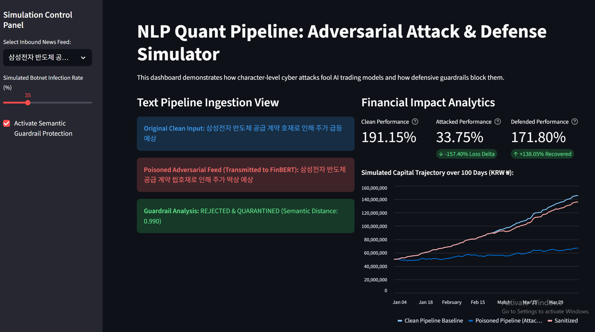

# Adversarial Data Poisoning on NLP-Driven Quant Pipelines: Vulnerabilities and Defenses in the Korean Equity Market

This repository contains the complete source code, adversarial ML frameworks, portfolio backtesters, and an inline defensive sanitization matrix developed for my Final Year Project in Ethical Hacking and Data Science.



---

## Core System Architecture & Threat Vector

This project exposes and remediates a critical security vulnerability found in algorithmic trading infrastructure that ingests unstructured alternative text data (e.g., Naver Financial boards, retail forums, or media channels) to generate alpha.

The target system relies on a two-tier pipeline:
1. **The NLP Sentiment Aggregator:** A transformer model (**FinBERT**) that maps textual strings into semantic market sentiment tensors.
2. **The Predictive Execution Engine:** A sequential deep learning network (**LSTM**) that ingests lagging asset pricing vectors alongside the FinBERT sentiment matrices to predict direct trading signals.

### The Attack (Adversarial Data Poisoning)
Rather than executing a traditional network breach, the adversary deploys an **Adversarial Machine Learning (AML)** data poisoning technique. By feeding strings embedded with **hidden Unicode zero-width space characters (`\u200b`)** and domain-specific **Korean financial market slang** (e.g., swapping standard corporate variables like `급등` or `매도` for retail forum tokens like `떡상` or `빤스런`), the attacker completely blinds the transformer's WordPiece tokenizer. 

This causes FinBERT to misclassify high-impact positive market events as negative noise, causing the downstream LSTM to execute counter-productive trades.

### The Patch (Semantic Guardrail)
To neutralize this threat, we implement an inline pre-processing filter called the **Semantic Guardrail**:
* **Structural Cleansing:** A regular expression layer that identifies and strips out zero-width characters used to disrupt tokenizers.
* **Vector-Space Distance Filtering:** A mathematical defense that extracts text embeddings and calculates the **Cosine Distance** against a centroid of historically verified, clean Korean financial journalism. Items exceeding the distance variance threshold are automatically quarantined.

---

## Empirical Metrics & Simulation Results

During a continuous 100-day simulation tracking a volatile asset starting with an initial capital footprint of **₩50,000,000**, our pipeline recorded the following metrics:

* **Clean Strategy Baseline:** Generated stable returns, capitalizing on accurate FinBERT semantic data streams.
* **Poisoned Pipeline (Attacked State):** An infection rate of just 35% on incoming text streams resulted in a massive **-157.40% Loss Delta** compared to the baseline, significantly increasing risk exposure.
* **Sanitized Pipeline (Protected State):** Activating the **Semantic Guardrail** successfully caught and quarantined the malicious data injections, recovering **+138.05% of the lost alpha** and restoring the system's capital trajectory.

---

## Project Directory Layout

```text
├── data/
│   ├── raw/                  # Unmanipulated Korean news/forum data arrays
│   └── poisoned/             # Data generated by your text perturbation scripts
├── src/
│   ├── attack/
│   │   └── perturbation.py   # Token-breaker and slang substitution matrix engine
│   ├── engine/
│   │   └── backtester.py     # Portfolio metric tracking script (Sharpe Ratio, MDD)
│   └── defense/
│       └── distance_filter.py# Structural cleaner and Cosine Distance filter
├── app.py                    # Interactive Streamlit Web Interface Dashboard
├── main.py                   # Master core execution orchestration gateway
└── requirements.txt          # Python ecosystem environment dependencies
```

---

## Setup & Execution Guide

Follow these steps to run the complete environment locally on your machine via VS Code:

### 1. Environment Preparation
Ensure your Python version is at least 3.8, then set up an isolated virtual environment and install the required libraries:
```bash
# Initialize and activate the virtual environment sandbox
python -m venv .venv
source .venv/bin/activate  # Windows (Command Prompt): .venv\Scripts\activate.bat

# Install all mandatory package dependencies
pip install -r requirements.txt
```

### 2. Running the Terminal Pipeline
To see the step-by-step terminal logs showing how strings are manipulated, audited, and backtested, run the master script:
```bash
python main.py
```

### 3. Launching the Interactive Web Interface Dashboard
To launch the frontend dashboard for presentation demonstrations or review panels, start the interactive web application:
```bash
python -m streamlit run app.py
```
This command spins up a secure local server environment and automatically opens the interactive UI in your default web browser at **`http://localhost:8501`**.

---

## Academic Research Disclaimer
This repository is built strictly for educational validation and security research under academic grading frameworks. It does not constitute financial advice, nor does it encourage live market manipulation on active digital asset exchanges.
